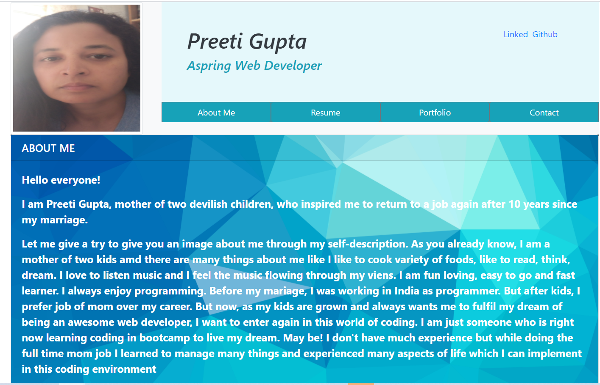
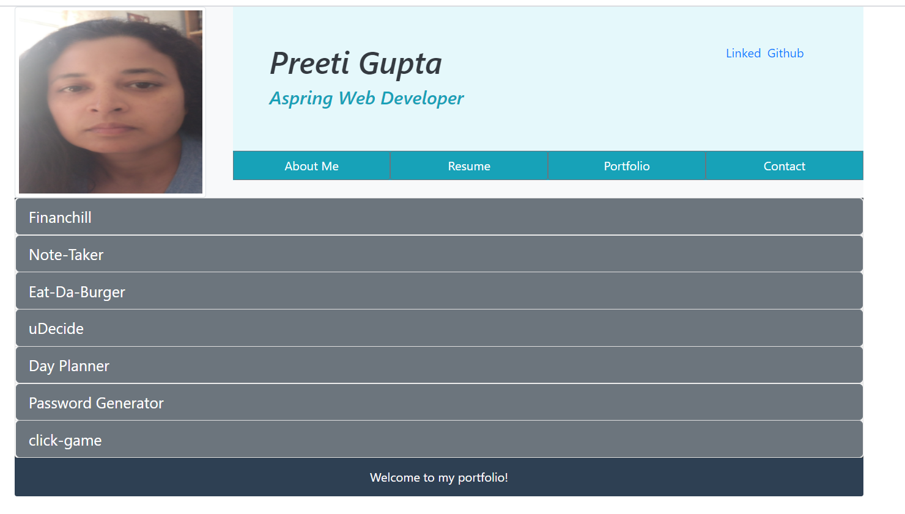
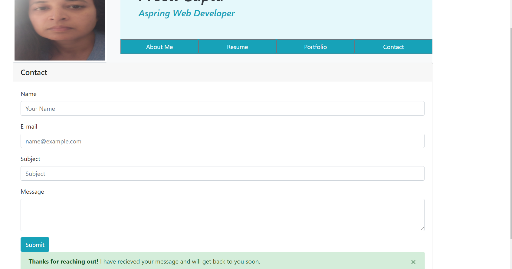

# Portfolio

The purpose of this assignment was to make responsive portfolio for mobile and tablet using Bootstrap CSS Framework.  
 

## Getting Started

### Prerequisites
1. Bootstrap Framework.(https://stackpath.bootstrapcdn.com/bootstrap/4.5.0/css/bootstrap.min.css)

2. *CSS*

3. *Javascript*

4. *jQuery*

5. *React*

6. *npm package*

##  Details of Project

Creating portfolio for myself which will work on both mobile and tablets. It has three links which is shown in one page using react. A Header component that appears on multiple pages, a single Project component that will be used multiple times on a single page, and a Footer component that appears on multiple pages. The hompage contains links to resume,contact, Project.
1. Home: By Default About me is displayed.   
2. Resume: It contains my resume.
3. Project: It contains some of my work such as Financhill, Eat-Da-Burger, Note-Taker, uDecide, workdays-schedular and Password Generator.
4. Contact: It contains contact form where you can input the information.

By default About me is display. To view other pages use the navigation link which will open in the frame in my home page.

My Schedular Website Link ->  ()

